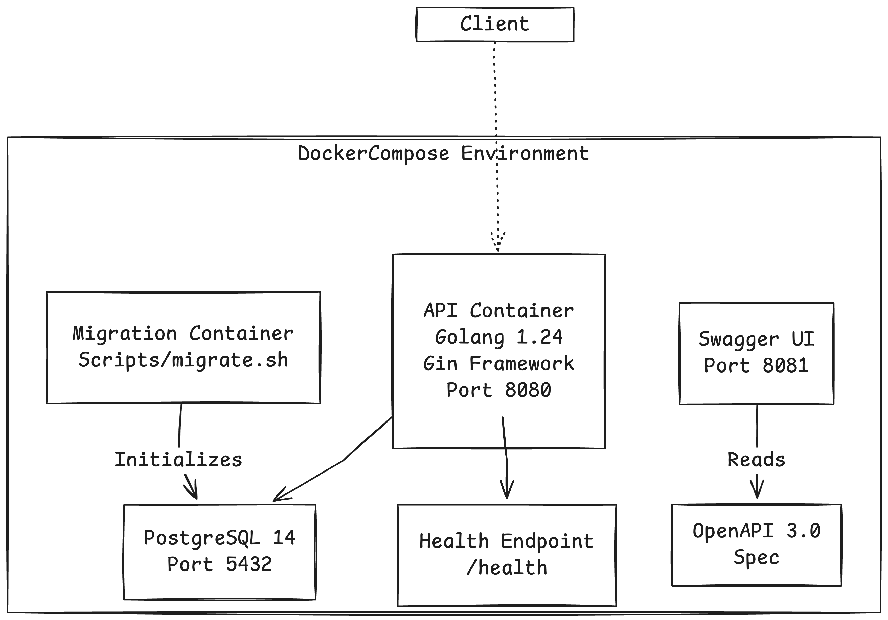
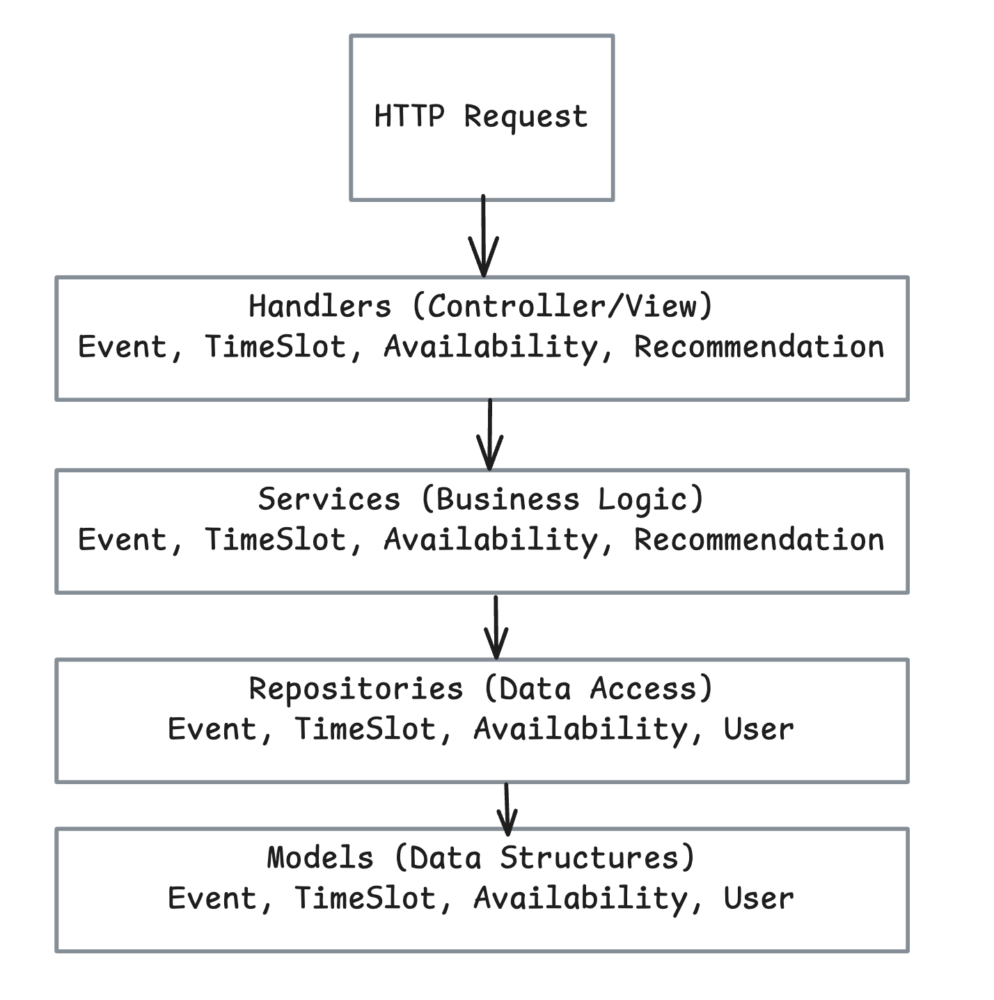
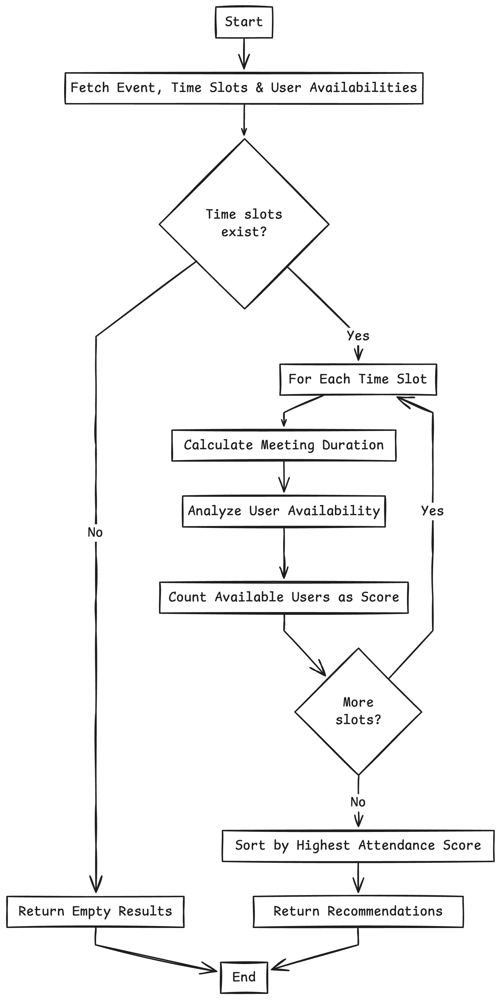

# Meeting Scheduler API

### Table of Contents
1. [Project Overview](#project-overview)
2. [Problem Statement](#problem-statement)
3. [Core Features](#core-features)
4. [Architecture](#architecture)
   - [System Architecture](#system-architecture)
   - [Data Model](#data-model)
   - [Layered Architecture](#layered-architecture)
   - [Recommendation Algorithm](#recommendation-algorithm)
5. [API Endpoints](#api-endpoints)
6. [Technology Stack](#technology-stack)
7. [Deployment](#deployment)
   - [Local Development](#local-development)
   - [Cloud Deployment](#cloud-deployment)
8. [Testing](#testing)
9. [Assumptions and Limitations](#assumptions-and-limitations)
10. [Future Enhancements](#future-enhancements)

---

## Project Overview

The Meeting Scheduler API is a RESTful service designed to solve the challenge of finding optimal meeting times for geographically distributed teams. The system allows organizers to create events with multiple time slot options, collects availability from participants, and recommends optimal meeting times based on maximum attendance.

## Problem Statement

This API addresses the problem by:
- Allowing event organizers to create events with multiple candidate time slots
- Collecting availability preferences from all participants
- Recommending optimal time slots based on maximum attendance
- Providing a ranked list with details of who can and cannot attend each option

## Core Features

- **Event Management**:
  - Create, read, update, and delete events
  - Each event has a title, description, duration, and status

- **Time Slot Management**:
  - Define multiple potential meeting times for each event
  - Store start and end times in a standardized format

- **Availability Collection**:
  - Capture each participant's availability for an event
  - Store availability as time ranges (start/end times)

- **Recommendation Engine**:
  - Analyze all time slots and participant availability
  - Rank slots by maximum possible attendance
  - Include details of who can and cannot attend each option

- **RESTful API**:
  - Follows REST conventions
  - Provides comprehensive endpoints for all operations
  - Returns appropriate HTTP status codes and error messages

## Architecture

The Meeting Scheduler follows a containerized microservice architecture.

**Deployment Architecture:**
- Docker Compose with Golang API, PostgreSQL, OpenAPI and SwaggerUI 


### Data Model

The system uses a relational database with the following entity structure.

```
USERS {
    uuid id (PK)
    string name
    string email
    timestamp created_at
    timestamp updated_at
}

EVENTS {
    uuid id (PK)
    string title
    string description
    uuid creator_id (FK -> USERS)
    int duration
    enum status (draft|active|canceled)
    timestamp created_at
    timestamp updated_at
}

TIME_SLOTS {
    uuid id (PK)
    uuid event_id (FK -> EVENTS)
    datetime start_time
    datetime end_time
    timestamp created_at
    timestamp updated_at
}

AVAILABILITIES {
    uuid id (PK)
    uuid user_id (FK -> USERS)
    uuid event_id (FK -> EVENTS)
    datetime start_time
    datetime end_time
    timestamp created_at
    timestamp updated_at
}
```

**Key Relationships:**
- A user can create multiple events (one-to-many)
- An event can have multiple time slots (one-to-many)
- A user can provide availability for multiple events (one-to-many)
- An event collects availability from multiple users (one-to-many)


### Layered Architecture

The application follows clean architecture principles with clear separation of concerns.



- **Handlers**: Process HTTP requests, validate input, return responses
- **Services**: Implement business logic and orchestrate operations
- **Repositories**: Handle data access and storage operations
- **Models**: Define data structures and object relationships

### Recommendation Algorithm

The recommendation algorithm identifies optimal meeting times using the following approach:



1. Fetch all time slots for the event
2. Fetch all user availability records
3. For each time slot:
   - Calculate the meeting end time based on event duration
   - Check each user's availability against the time slot
   - Count available users to calculate a slot's score
4. Sort time slots by highest attendance score
5. Return ranked recommendations with attendee/non-attendee lists

**Complexity:**
- Time Complexity: O(S × U + S log S) where S = number of slots, U = number of users
- Space Complexity: O(S + A + U) where A = number of availability records

## API Endpoints

### Event Endpoints
- `POST /events` - Create a new event
- `GET /events` - List all events
- `GET /events/:id` - Get details of a specific event
- `PUT /events/:id` - Update an existing event
- `DELETE /events/:id` - Delete an event

### Time Slot Endpoints
- `POST /events/:id/timeslots` - Add a time slot to an event
- `GET /events/:id/timeslots` - List all time slots for an event
- `PUT /timeslots/:id` - Update a time slot
- `DELETE /timeslots/:id` - Delete a time slot

### Availability Endpoints
- `POST /events/:id/availability` - Add availability for an event
- `GET /events/:id/availability` - Get all availability for an event
- `GET /events/:id/availability/:userId` - Get availability for a specific user
- `PUT /events/:id/availability/:userId` - Update user's availability
- `DELETE /availability/:id` - Delete an availability record

### Recommendation Endpoint
- `GET /events/:id/recommendations` - Get ranked time slot recommendations

### Health Check
- `GET /health` - Check API health status

## Technology Stack

- **Backend**: Go 1.24 with Gin web framework
- **Database**: PostgreSQL 14
- **ORM**: GORM for database interactions
- **API Documentation**: OpenAPI 3.0 with Swagger UI
- **Containerization**: Docker with Docker Compose
- **Infrastructure as Code**: Terraform support (basic**)

## Deployment

### Local Development

The application can be run locally using Docker Compose:

```bash
# Clone the repository
git clone https://github.com/npkanaka/meeting-scheduler.git

# Navigate to project directory
cd meeting-scheduler

# Start with Docker Compose
docker-compose up
```

This will start:
- API service on port 8080
- PostgreSQL database on port 5432
- Swagger UI documentation on port 8081
- Migration service to initialize the database

### Cloud Deployment

The project includes Basic Terraform configurations for AWS deployment:

```bash
# Navigate to Terraform directory
cd deployments/terraform

# Initialize Terraform
terraform init

# Apply configuration (you will be prompted for variables)
terraform apply
```

Required Terraform variables:
- `aws_region` - AWS region to deploy to (default: us-east-1)
- `db_username` - Database username (default: postgres)
- `db_password` - Database password (sensitive, must be provided)
- `db_name` - Database name (default: scheduler)
- `container_image` - URL of the container image to deploy

## Testing

The application includes comprehensive unit tests for core services:
- Event Service tests
- Time Slot Service tests
- Availability Service tests
- Recommendation Service tests

Tests use Go's testing package with mock repositories for isolation.

Run tests with:
```bash
go test ./internal/service -coverprofile=coverage.out
go tool cover -html=coverage.out  # View coverage report
```
Resulted Coverage: **85.1%** of statements

## Assumptions and Limitations

### Assumptions
1. **Authentication and Authorization**: The current implementation assumes a simplified authentication model with user IDs provided in requests.
2. **Time Zones**: All times are stored in UTC. Clients are responsible for converting to local time zones.
4. **User Management**: Basic user model exists, but user registration/management is outside the current scope.
5. **Concurrency**: The system handles concurrent requests through Gin's built-in concurrency model. (Usecases are not tested)

## Future Enhancements

Potential extensions to the system could include:
1. **Authentication System**: Implement JWT-based authentication and authorization.
2. **User Management**: Add complete user registration and profile management.
3. **Advanced Recommendation Logic**: Consider other parameters like working hours, time zones, and meeting frequency in recommendations.

---